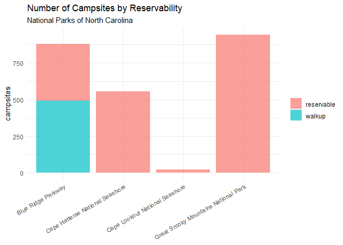
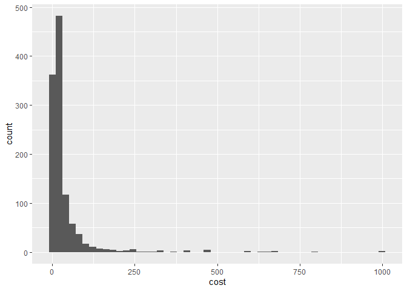
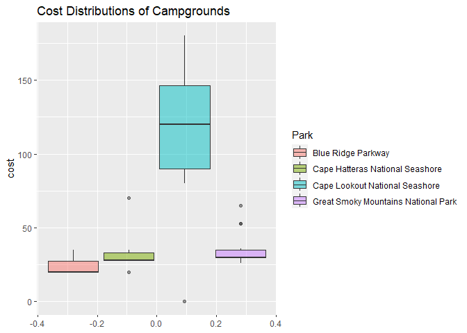
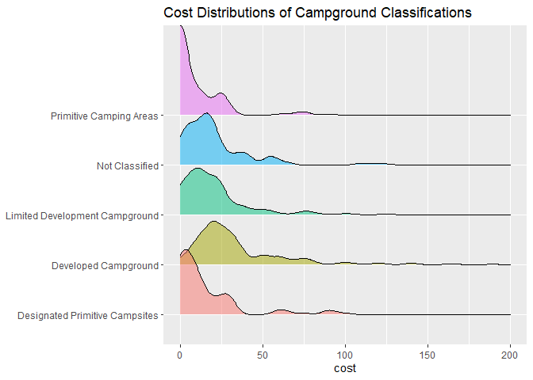

Reading Data from APIs
================

## Requirements

The packages used in this vignette to interact with the API are:

[`tidyverse`](https://www.tidyverse.org/)
[`httr`](https://httr2.r-lib.org/)
[`jsonlite`](https://cran.r-project.org/package=jsonlite)

I also used a few other packages to visualize the data:

[`DT`](https://rstudio.github.io/DT/)
[`kableExtra`](https://cran.r-project.org/web/packages/kableExtra/vignettes/awesome_table_in_html.html)
[`ggridges`](https://cran.r-project.org/web/packages/ggridges/vignettes/introduction.html)

I wanted to query the National Parks service API which provides
information about US National Parks. In order to interact with this API
you will need an api key. You can register for a free API key
[here](https://www.nps.gov/subjects/developer/get-started.htm). This API
allows 1,000 requests per hour! That’s pretty generous as far as APIs
go. You can also read more information about it in the [API
Guide](https://www.nps.gov/subjects/developer/guides.htm). In order to
keep my own API key a secret I have aliased it in the remaining code as
`my_api_key`, but you can create a variable called `my_api_key` which
will be the default of the functions in this vignette, or you can simply
enter your api key into the functions.

## Functions

There are several functions I created in order to interact with the API.

### Helper Functions

#### `get_state_codes`

The first is a helper function `get_state_codes`. For some of the API
endpoints the National Parks Service allows the user to enter the two
character state abbreviation. In our final API function we want to be a
bit more flexible and allow the user to be able to enter the name of a
state, the two digit state code, or leave the state parameter blank (the
default will be null) to return all states. The `get_state_codes`
function takes one parameter which is either the name of a state, the
state abbreviation, and either returns a corresponding state
abbreviation or ensures that the state abbreviation entered is valid. It
uses the built in R datasets
[state.abb](https://www.rdocumentation.org/packages/datasets/versions/3.6.2/topics/state)
and
[state.name](https://www.rdocumentation.org/packages/datasets/versions/3.6.2/topics/state).

``` r
get_state_codes <- function(state) {

    # convert the state parameter to lower case
    state <- tolower(state)
    # convert built in state abbreviations and state names
    # to lower case
    state_abbs <- tolower(state.abb)
    state_names <- tolower(state.name)

    # if the state entered by the user is a state name:
    if (state %in% state_names) {

        # get the index of the state.name and return the
        # abbreviation at that index
        state <- state_abbs[which(state_names == state)]

    }

    # if the state is not an abbreviation (or has been
    # converted to one by the previous if statement)
    if (state %in% state_abbs) {

        # return the abbreviation
        return(state)

        # if the state is not an abbreviation
    } else {

        # output a helpful error message
        stop("Please enter a valid state name or abbreviation or 'all' to query all states")

    }

}
```

#### `get_max_results`

The National Parks APIs allow the user to set a limit of how many
results to return, and if the user does not specify a default limit is
set (usually 50 for most endpoints). This is helpful if you don’t want
to return too many results, but can be problematic if you don’t know how
many results there actually are. Thankfully when the data is returned
the total number of possible results is also returned in a field called
“total” as well as the limit set in a field called “limit”. Using these
fields I created a function to make sure we don’t inadvertently return
too few results.

``` r
get_max_results <- function(url) {

    # call the api and get results
    api_call <- GET(url)

    # parse the data from JSON
    parsed_data <- fromJSON(rawToChar(api_call$content), simplifyDataFrame = TRUE)

    # if the number of results possible is greater than the
    # number of results returned, call the api again with
    # the max possible results
    if (as.numeric(parsed_data$limit) < as.numeric(parsed_data$total)) {

        url <- paste0(url, "&limit=", parsed_data$total)

        api_call <- GET(url)

        # parsed_data <-
        # fromJSON(rawToChar(api_call$content))

    }

    # return the parsed_data
    return(api_call)

}
```

#### `get_park_codes`

Some NPS API endpoints do not allow the user to enter a state and
instead require the park code. These definitely are not values that I
would expect many people to know off of the top of their head. I created
another helper function called `get_park_codes` to solve this problem.
This function has a state parameter which can be left blank (default
null) to select all park codes, or using the `get_state_code` helper
function the user can enter a state abbreviation or name. The function
calls the parks endpoint and returns a character vector of all of the
park codes associated with that state.

``` r
get_park_codes <- function(state = NULL, api_key = my_api_key) {

    # start with a base url of the api call
    url <- "https://developer.nps.gov/api/v1/parks?"

    # if the state parameter is not null
    if (!is.null(state)) {

        # get the state code
        state_code <- get_state_codes(state)

        # add the state code parameter to the url
        url <- paste0(url, "&stateCode=", state_code)

    }

    # add the api key to the url
    url <- paste0(url, "&api_key=", api_key)

    # get the max number of results available from the api
    res <- get_max_results(url)

    # parse the content
    content <- fromJSON(rawToChar(res$content))

    # output a dataframe with the distinct park names and
    # codes
    out <- content$data %>%
        select(parkCode, fullName) %>%
        distinct()

    return(out)

}
```

#### `handle_list_columns`

Once our data has been returned from the API and parsed we will need a
little extra help flattening it into a neat tibble or a list of tibbles.
For example when calling the parks API endpoint the data returned
contains list columns for certain variables even after using `fromJSON`
in the
[jsonlite](https://cran.r-project.org/web/packages/jsonlite/vignettes/json-aaquickstart.html)
package. This function takes a tibble or data.frame that contains list
columns and a character vector for the column name. It returns a tibble
with the id and the values of the list column as a tibble. For this we
use the `unnest` function from the [purrr](https://purrr.tidyverse.org/)
package which is part of the tidyverse.

``` r
handle_list_columns <- function(list_column, .data) {

    # ensym the list_column parameter so that it may be
    # passed in the functions
    column_name <- ensym(list_column)

    out <- .data %>%
        # select the id and the list column name
    select(id, !!column_name) %>%
        # remove empty columns
    filter(lengths(!!column_name) != 0) %>%
        # unnest the list column
    unnest(!!column_name, names_sep = "")

    # return the data
    return(out)
}
```

#### `rectangle_data`

Our `handle_list_columns` function gets used in a `rectangle_data`
function. This function takes the data (including list columns) flattens
it, finds columns that remain as lists and handles them individually.
The default output is a list of dataframes, however the user can specify
that they would like the data to be returned in one neat dataframe in
which case the function will `enframe` and `unnest` again using the
[purrr](https://purrr.tidyverse.org/). package. The data becomes longer
as a result with more repeating variables due to left joins necessary to
make this work. The user can also choose a single dataset from the
particular api call, or a character vector of dataset names. For example
the parks api endpoint has many datasets embedded within the single call
including activities, or park entry fees. The user can choose how much
or how little data they would like to return.

``` r
rectangle_data <- function(.data, output_tibble = FALSE, datasets = NULL) {

    # flatten the data and remove columns we are not
    # interested in
    dat <- flatten(.data) %>%
        select(-matches("passportStampImages|images|multimedia|contacts|addresses|operatingHours"))

    # create a data frame with all of the columns that are
    # character vectors (i.e are already flat)
    flat_data <- dat %>%
        select_if(is.character)

    # select columns that are not character vector columns
    # along with the id (for joining later or associating
    # with other datasets) these columns will need to be
    # flattened separately due to ragged hierarchy
    list_columns <- dat %>%
        select(id, where(negate(is.character)))

    # get a character vector of the names of the columns
    # that need to be unnested further
    list_cols <- list_columns %>%
        select(-id) %>%
        names()

    # handle the remaing list columns using our
    # handle_list_columns function
    out <- as.list(list_cols) %>%
        set_names(list_cols) %>%
        map(handle_list_columns, list_columns) %>%
        # remove empty dataframes from the resulting list
        # of dataframes
    discard(~nrow(.x) == 0) %>%
        # prepend the flattened data to the begining of the
        # list of dataframes
    append(list(main_data = flat_data), after = 0)

    # if the user entered the datasets parameter
    if (!is.null(datasets)) {

        # if all of the dataset names the user entered are
        # valid
        if (all(datasets %in% names(out))) {

            # if the user did not select to include all of
            # the main data
            if (!"main_data" %in% datasets) {

                # get the ids parkCodes and name/fullName
                # from the main data
                all_ids <- out$main_data %>%
                  select(id, parkCode, matches("fullName|name"))

                # subset the data to just the datasets the
                # user selected
                out <- out[datasets] %>%
                  # prepend all of the ids to the list of
                  # dataframes selected
                append(list(all_ids = all_ids), after = 0)

                # subset the data to just the datasets the
                # user selected
            } else {
                out <- out[datasets]
            }
        } else {
            # throw an error and output a helpful message
            stop("Please enter valid dataset(s)")
        }

    }

    # if the user selects the output to be a tibble left
    # join the datasets together on the parkcode
    if (output_tibble) {

        out <- out %>%
            reduce(left_join, by = "id")
    }

    # return data
    return(out)

}
```

### API Functions

#### `get_park_info`

With the helper functions set, I’m ready to interact with the API to
bring back data. The first endpoint I want to interact with is the parks
endpoint. This endpoint provides a lot of information about each park as
we will see. To bring back data from this endpoint I created a function
`get_park_info`. The endpoint allows the user to enter a state or a park
code, so we will use our `get_state_codes` helper function. We will also
need our `rectangle_data` function.

I also wanted to explore the campgrounds available at the parks. The NPS
API has a campground endpoint which provides information about different
campsites, how many spots are available, hours of operation, types of
campsites, cost, etc. In order to allow the user to select the endpoint
desired (‘parks’, or ‘campgrounds’ in this example), I allow the user to
enter an endpoint parameter. The user can also enter the state and/or
the park code desired.

``` r
get_park_info <- function(state = NULL, park_code = NULL, api_key = my_api_key,
    endpoint = "campgrounds", ...) {

    # start with a base url of the api call and add the
    # endpoint
    url <- paste0("https://developer.nps.gov/api/v1/", endpoint,
        "?")

    # if the user enters a state name or code
    if (!is.null(state)) {

        # get the state code
        state_code <- get_state_codes(state)

        # add the state code parameter to the url
        url <- paste0(url, "&stateCode=", state_code)

    }

    # if user enters a park code
    if (!is.null(park_code)) {

        # add the park_code to the url
        url <- paste0(url, "&parkCode=", park_code)
    }

    # add the api key to the url
    url <- paste0(url, "&api_key=", my_api_key)

    # get the maximum restuls from the api
    res <- get_max_results(url)

    # extract the content from the JSON object
    content <- fromJSON(rawToChar(res$content))

    # extract the data
    dat <- content$data

    # get the data into a list of dataframes or a single
    # tibble based on user selection
    out <- rectangle_data(dat, ...)

    # return data
    return(out)

}
```

### Data Exploration

With our API functions ready we can now start exploring the data.

#### Campground Classifications

The National Parks Campgrounds have several classifications based on how
primative or developed they are. I first looked at all campgrounds
nationally, and then narrowed the set to just the Parks in North
Carolina. It looks like Great Smoky Mountains National Park has the most
developed campgrounds.

``` r
# What types of parks do our National Parks have?
campground_classifications <- get_park_info(endpoint = "campgrounds",
    datasets = "accessibility.classifications", output_tibble = TRUE) %>%
    mutate(classification = replace_na(accessibility.classifications,
        "Not Classified"))

# get all of the park codes and names
park_names <- get_park_codes()
# get just the NC parks
nc_parks <- get_park_codes(state = "NC")

# get a contingency table of campground classifications by
# park
park_classifications <- park_names %>%
    inner_join(campground_classifications, by = "parkCode") %>%
    select(fullName, classification) %>%
    table() %>%
    as.data.frame() %>%
    pivot_wider(names_from = classification, values_from = Freq) %>%
    arrange(-`Developed Campground`) %>%
    inner_join(nc_parks, by = "fullName") %>%
    rename(Park = fullName)


knitr::kable(park_classifications %>%
    select(-parkCode))
```

<table>
<thead>
<tr>
<th style="text-align:left;">
Park
</th>
<th style="text-align:right;">
Designated Primitive Campsites
</th>
<th style="text-align:right;">
Developed Campground
</th>
<th style="text-align:right;">
Limited Development Campground
</th>
<th style="text-align:right;">
Not Classified
</th>
<th style="text-align:right;">
Primitive Camping Areas
</th>
</tr>
</thead>
<tbody>
<tr>
<td style="text-align:left;">
Great Smoky Mountains National Park
</td>
<td style="text-align:right;">
0
</td>
<td style="text-align:right;">
10
</td>
<td style="text-align:right;">
0
</td>
<td style="text-align:right;">
3
</td>
<td style="text-align:right;">
0
</td>
</tr>
<tr>
<td style="text-align:left;">
Blue Ridge Parkway
</td>
<td style="text-align:right;">
0
</td>
<td style="text-align:right;">
8
</td>
<td style="text-align:right;">
0
</td>
<td style="text-align:right;">
0
</td>
<td style="text-align:right;">
0
</td>
</tr>
<tr>
<td style="text-align:left;">
Cape Hatteras National Seashore
</td>
<td style="text-align:right;">
0
</td>
<td style="text-align:right;">
4
</td>
<td style="text-align:right;">
0
</td>
<td style="text-align:right;">
0
</td>
<td style="text-align:right;">
0
</td>
</tr>
<tr>
<td style="text-align:left;">
Cape Lookout National Seashore
</td>
<td style="text-align:right;">
0
</td>
<td style="text-align:right;">
1
</td>
<td style="text-align:right;">
0
</td>
<td style="text-align:right;">
0
</td>
<td style="text-align:right;">
1
</td>
</tr>
</tbody>
</table>

#### Campground Connectivity

If you’re like me and you enjoy “car camping” you might be interested to
know how the internet and cell reception are at our national parks. The
campgrounds endpoint provides that information as well as other
amenities. We can create a table showing the overlap of internet service
and cellphone reception. As it turns out, the majority of campgrounds
don’t have either, so if you want to totally unplug you’re in luck.
There are 13 campgrounds however that have access to both cell phone
reception and internet year round.

``` r
# internet connectivity and cellphone reception
campgrounds <- get_park_info(endpoint = "campgrounds", datasets = c("main_data"),
    output_tibble = TRUE) %>%
    inner_join(park_names, by = "parkCode") %>%
    rename(Park = fullName, Campground = name)

# get a contingency table of internet and phone
# connectivity
internet_and_phone <- campgrounds %>%
    select(amenities.internetConnectivity, amenities.cellPhoneReception) %>%
    filter(amenities.internetConnectivity != "" & amenities.cellPhoneReception !=
        "") %>%
    table()


knitr::kable(internet_and_phone) %>%
    add_header_above(header = c(Internet = 1, `Cell Reception` = 3))
```

<table>
<thead>
<tr>
<th style="border-bottom:hidden;padding-bottom:0; padding-left:3px;padding-right:3px;text-align: center; " colspan="1">

<div style="border-bottom: 1px solid #ddd; padding-bottom: 5px; ">

Internet

</div>

</th>
<th style="border-bottom:hidden;padding-bottom:0; padding-left:3px;padding-right:3px;text-align: center; " colspan="3">

<div style="border-bottom: 1px solid #ddd; padding-bottom: 5px; ">

Cell Reception

</div>

</th>
</tr>
<tr>
<th style="text-align:left;">
</th>
<th style="text-align:right;">
No
</th>
<th style="text-align:right;">
Yes - seasonal
</th>
<th style="text-align:right;">
Yes - year round
</th>
</tr>
</thead>
<tbody>
<tr>
<td style="text-align:left;">
No
</td>
<td style="text-align:right;">
386
</td>
<td style="text-align:right;">
32
</td>
<td style="text-align:right;">
153
</td>
</tr>
<tr>
<td style="text-align:left;">
Yes - seasonal
</td>
<td style="text-align:right;">
3
</td>
<td style="text-align:right;">
3
</td>
<td style="text-align:right;">
5
</td>
</tr>
<tr>
<td style="text-align:left;">
Yes - year round
</td>
<td style="text-align:right;">
3
</td>
<td style="text-align:right;">
0
</td>
<td style="text-align:right;">
13
</td>
</tr>
</tbody>
</table>

#### Campground Reservability

The NPS API also offers data about how many campsites are reservable
vs. first-come-first-serve. We can create plots to see which parks have
campgrounds that allow you to go camping without a reservation. If
you’re not much of a planner and you don’t want to reserve a spot in
advance the Blue Ridge Parkway is your best bet.

``` r
# get northcarolina campground information by calling our
# api function
campgrounds_NC <- get_park_info(state = "NC", endpoint = "campgrounds",
    datasets = c("main_data"), output_tibble = TRUE) %>%
    inner_join(park_names, by = "parkCode") %>%
    rename(Park = fullName, Campground = name)

# pivot the data to counts of campsites by walkup vs
# reservable
campsites <- campgrounds_NC %>%
    select(Park, Campground, numberOfSitesReservable, numberOfSitesFirstComeFirstServe) %>%
    mutate(reservable = as.numeric(numberOfSitesReservable),
        walkup = as.numeric(numberOfSitesFirstComeFirstServe),
        .keep = "unused") %>%
    pivot_longer(cols = c(reservable, walkup), names_to = "site_type",
        values_to = "campsites")

# barplot of campsites reservability
ggplot(data = campsites, aes(x = Park, y = campsites, fill = site_type)) +
    geom_bar(position = "stack", stat = "identity", alpha = 0.7) +
    scale_x_discrete(guide = guide_axis(angle = 30)) + scale_fill_discrete(name = "") +
    theme_minimal() + labs(x = NULL, title = "Number of Campsites by Reservability",
    subtitle = "National Parks of North Carolina")
```

<!-- -->

#### Campsite Numbers

We can also create numeric summaries of the number of campsites across
the parks. We already knew that the Great Smoky Mountains National Park
has the most campgrounds, so it is no surprise that it also has the most
campsites. The largest campground has 211 sites, but the spread is quite
wide and the smallest only has 1.

``` r
# Create numeric summaries of the number of campsites at
# each campground in NC parks
total_campsites <- campgrounds %>%
    select(Park, parkCode, Campground, total_sites = campsites.totalSites) %>%
    mutate(total_sites = as.numeric(total_sites)) %>%
    group_by(Park, parkCode) %>%
    filter(total_sites > 0) %>%
    summarise(`Total Campsites` = sum(total_sites), `Average Sites per Campground` = mean(total_sites),
        `Sites at Smallest Campground` = min(total_sites), `Sites at Largest Campground` = max(total_sites),
        `Std Dev` = sd(total_sites)) %>%
    ungroup() %>%
    arrange(-`Total Campsites`) %>%
    inner_join(nc_parks, by = c(Park = "fullName", "parkCode"))

kable(total_campsites %>%
    select(-parkCode))
```

<table>
<thead>
<tr>
<th style="text-align:left;">
Park
</th>
<th style="text-align:right;">
Total Campsites
</th>
<th style="text-align:right;">
Average Sites per Campground
</th>
<th style="text-align:right;">
Sites at Smallest Campground
</th>
<th style="text-align:right;">
Sites at Largest Campground
</th>
<th style="text-align:right;">
Std Dev
</th>
</tr>
</thead>
<tbody>
<tr>
<td style="text-align:left;">
Great Smoky Mountains National Park
</td>
<td style="text-align:right;">
939
</td>
<td style="text-align:right;">
78.250
</td>
<td style="text-align:right;">
3
</td>
<td style="text-align:right;">
211
</td>
<td style="text-align:right;">
73.14012
</td>
</tr>
<tr>
<td style="text-align:left;">
Blue Ridge Parkway
</td>
<td style="text-align:right;">
881
</td>
<td style="text-align:right;">
110.125
</td>
<td style="text-align:right;">
64
</td>
<td style="text-align:right;">
190
</td>
<td style="text-align:right;">
41.75930
</td>
</tr>
<tr>
<td style="text-align:left;">
Cape Hatteras National Seashore
</td>
<td style="text-align:right;">
561
</td>
<td style="text-align:right;">
140.250
</td>
<td style="text-align:right;">
107
</td>
<td style="text-align:right;">
202
</td>
<td style="text-align:right;">
42.76584
</td>
</tr>
<tr>
<td style="text-align:left;">
Cape Lookout National Seashore
</td>
<td style="text-align:right;">
24
</td>
<td style="text-align:right;">
12.000
</td>
<td style="text-align:right;">
1
</td>
<td style="text-align:right;">
23
</td>
<td style="text-align:right;">
15.55635
</td>
</tr>
</tbody>
</table>

#### Campsite Cost

Another important factor in choosing a national park and a campground is
cost. Cape Lookout National Seashore has both the most expensive and the
cheapest (you can get less expensive than free!) campgrounds. The high
cost is driven by cabin rentals which are also provided in the campsite
fees. Unfortunately the campsite fee descriptions do not offer clean
categorical groupings of the type of site and are free text values so
they do not allow us to easily see which campsites are cabins
vs. primitive sites in a nice graphical display.

``` r
# campground_fees

campground_fees <- get_park_info(endpoint = "campgrounds", datasets = c("fees"),
    output_tibble = TRUE) %>%
    inner_join(campgrounds, by = c("id", "parkCode")) %>%
    select(Park, parkCode, Campground, feescost) %>%
    mutate(cost = as.numeric(feescost)) %>%
    filter(!is.na(cost))


fee_summaries <- campground_fees %>%
    group_by(Park, parkCode) %>%
    summarise(`Median Campsite Fee` = round(median(cost), digits = 2),
        `Lowest Campsite Fee` = min(cost), `Highest Campsite Fee` = max(cost),
        `Std Dev` = sd(cost)) %>%
    ungroup() %>%
    arrange(-`Median Campsite Fee`) %>%
    inner_join(nc_parks, by = c(Park = "fullName", "parkCode"))

kable(fee_summaries %>%
    select(-parkCode))
```

<table>
<thead>
<tr>
<th style="text-align:left;">
Park
</th>
<th style="text-align:right;">
Median Campsite Fee
</th>
<th style="text-align:right;">
Lowest Campsite Fee
</th>
<th style="text-align:right;">
Highest Campsite Fee
</th>
<th style="text-align:right;">
Std Dev
</th>
</tr>
</thead>
<tbody>
<tr>
<td style="text-align:left;">
Cape Lookout National Seashore
</td>
<td style="text-align:right;">
120
</td>
<td style="text-align:right;">
0
</td>
<td style="text-align:right;">
180
</td>
<td style="text-align:right;">
63.43632
</td>
</tr>
<tr>
<td style="text-align:left;">
Great Smoky Mountains National Park
</td>
<td style="text-align:right;">
30
</td>
<td style="text-align:right;">
26
</td>
<td style="text-align:right;">
65
</td>
<td style="text-align:right;">
10.73854
</td>
</tr>
<tr>
<td style="text-align:left;">
Cape Hatteras National Seashore
</td>
<td style="text-align:right;">
28
</td>
<td style="text-align:right;">
20
</td>
<td style="text-align:right;">
70
</td>
<td style="text-align:right;">
17.87083
</td>
</tr>
<tr>
<td style="text-align:left;">
Blue Ridge Parkway
</td>
<td style="text-align:right;">
20
</td>
<td style="text-align:right;">
20
</td>
<td style="text-align:right;">
35
</td>
<td style="text-align:right;">
7.00649
</td>
</tr>
</tbody>
</table>

We can also see the distribution of cost across North Carolina Parks
visually in a boxplot.

``` r
# how to NC Campgrounds fare in terms of fees

nc_fees <- campground_fees %>%
    semi_join(nc_parks, by = "parkCode")

ggplot(data = nc_fees, aes(y = cost, fill = Park)) + geom_boxplot(alpha = 0.5) +
    labs(title = "Cost Distributions of Campgrounds")
```

<!-- -->

If we want to see how this compares on a national level. We can create a
histogram of the distribution of campground costs at all national parks.
This is a very right skewed distribution and the majority of campsites
are very affordable. There are however some outliers ranging all the way
up to \$1000!

``` r
# histogram
ggplot(data = campground_fees, aes(x = cost)) + geom_histogram(bins = 50)
```

<!-- -->

Since it is not possible to neatly graph the types of campsites for each
fee, we can instead summarise the fees at the level of the campground
classifications. The ridges plot below is another way to visualize the
distributions, but this time comparing the campground classifications
instead of the parks. As expective campgrounds with a primitive camping
designation tend to be on the lower end of cost, while developed
campgrounds tend to be more expensive.

``` r
# get each Campground's lowest cost campsite and the total
# number of campsites
sites_and_fees <- campground_fees %>%
    inner_join(campground_classifications, by = c("parkCode",
        Campground = "name"))

# plot the cost distributions across the types of
# campgrounds
ggplot(data = sites_and_fees, aes(x = cost, y = classification,
    fill = classification)) + geom_density_ridges(show.legend = FALSE,
    alpha = 0.5) + xlim(0, 200) + labs(y = NULL, title = "Cost Distributions of Campground Classifications",
    subtitle = "US National Parks")
```

<!-- -->

#### Park Activities

If we want to know which parks will give us the most bang for our buck
we can explore the activities available at each park. These activies
range from fly fishing to actual flying. The Great Smoky Mountains
National Park not only has the most campgrounds, but also the widest
range of activities available.

``` r
# get park activities
activities <- get_park_info(endpoint = "parks", datasets = "activities",
    output_tibble = TRUE)

# summarise the number of campgrounds
n_campgrounds_nc <- campgrounds_NC %>%
    select(Park, Campground) %>%
    group_by(Park) %>%
    summarise(Campgrounds = n_distinct(Campground))

# summarise the number of activities and join to number of
# campgrounds
activites_nc <- activities %>%
    inner_join(nc_parks, by = c("parkCode", "fullName")) %>%
    rename(Park = fullName, Activity = activitiesname) %>%
    group_by(Park) %>%
    summarise(Activities = n_distinct(Activity)) %>%
    inner_join(n_campgrounds_nc, by = "Park") %>%
    pivot_longer(cols = c("Activities", "Campgrounds"))

# barplot
ggplot(data = activites_nc, aes(x = value, y = Park, fill = name)) +
    geom_bar(stat = "identity", position = "dodge", alpha = 0.7) +
    scale_fill_discrete(name = "") + labs(title = "Number of Activities and Campgrounds",
    subtitle = "National Parks of North Carolina", x = "Count",
    y = NULL)
```

<!-- -->

### Wrap-Up

To summarize we learned how to build functions to interact with 2 of the
National Park Service API endpoints. We also learned how to parse
through nested json data. We collected some of the data and explored
Campsite data Nationally and for North Carolina. We learned that the
Great Smoky Mountains National Park offers the greatest variety of
activities of North Carolina National Parks and the largest number of
campgrounds at an affordable price. We also learned that many of our
National Parks do not offer cell phone service or internet connectivity.
I hope that this vignette helps you use and interact with interact with
APIs.
