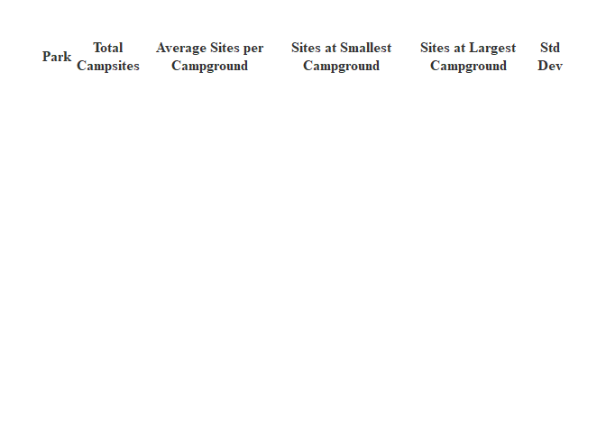

Reading Data from APIs
================

## Requirements

The packages used in this vignette are

[tidyverse](https://www.tidyverse.org/) [httr](https://httr2.r-lib.org/)
[jsonlite](https://cran.r-project.org/package=jsonlite)

## API

I wanted to query the National Parks service API which provides
information about US National Parks. In order to interact with this API
you will need an api key. You can register for a free API key
[here](https://www.nps.gov/subjects/developer/get-started.htm). This API
allows 1,000 requests per hour! That’s pretty generous as far as APIs
go. You can also read more information about it in the [API
Guide](https://www.nps.gov/subjects/developer/guides.htm). In order to
keep my own API key a secret I have aliased it in the remaining code as
`my_api_key`, but you can create a variable called `my_api_key` which
will be the default of the functions in this vignette, or you can simply
enter your api key into the functions.

## Functions

There are several functions I created in order to interact with the API.

### Helper Functions

#### `get_state_codes`

The first is a helper function `get_state_codes`. For some of the API
endpoints the National Parks Service allows the user to enter the two
character state abbreviation. In our final API function we want to be a
bit more flexible and allow the user to be able to enter the name of a
state, the two digit state code, or two leave the state parameter blank
(the default will be null) to return all states. The `get_state_codes`
function takes one parameter which is either the name of a state, the
state abbreviation, and either returns a corresponding state abbrevation
or ensures that the state abbreviation entered is valid. It uses the
built in R datasets
[state.abb](https://www.rdocumentation.org/packages/datasets/versions/3.6.2/topics/state)
and
[state.name](https://www.rdocumentation.org/packages/datasets/versions/3.6.2/topics/state).

``` r
get_state_codes <- function(state) {
    
    #convert the state parameter to lower case
    state <- tolower(state)
    #convert built in state abbreviations and state names to lower case
    state_abbs <- tolower(state.abb)
    state_names <- tolower(state.name)
    
    #if the state entered by the user is a state name:
    if(state %in% state_names) {
        
         #get the index of the state.name and return the abbreviation at that index
        state <- state_abbs[which(state_names == state)]
        
    }
    
    #if the state is not an abbreviation (or has been converted to one by the previous if statement)
    if(state %in% state_abbs) {
        
        #return the abbreviation
        return(state)
        
    #if the state is not an abbreviation
    }else{
        
        #output a helpful error message
        stop("Please enter a valid state name or abbreviation or 'all' to query all states")
        
    }
    
} 
```

#### `get_max_results`

The National Parks APIs allow the user to set a limit of how many
results to return, and if the user does not specify a default limit is
set (usually 50 for most endpoints). This is helpful if you don’t want
to return too many results, but can be problematic if you don’t know how
many results there actually are. Thankfully when the data is returned
the total number of possible results is also returned in a field called
“total” as well as the limit set in a field called “limit”. Using these
fields I created a function to make sure we don’t inadvertently return
too few results.

``` r
get_max_results <- function(url) {
    
    
    #call the api and get results
    api_call <- GET(url)
    
    #parse the data from JSON
    parsed_data <- fromJSON(rawToChar(api_call$content), simplifyDataFrame = TRUE)
    
    #if the number of results possible is greater than the number of results returned, call the api again with the max possible results
    if(as.numeric(parsed_data$limit) < as.numeric(parsed_data$total)) {
        
        url <- paste0(url, '&limit=', parsed_data$total)
        
        api_call <- GET(url)
        
        #parsed_data <- fromJSON(rawToChar(api_call$content))
    
    }
    
    #return the parsed_data
    return(api_call)
    
}
```

#### `get_park_codes`

Some NPS API endpoints do not allow the user to enter a state and
instead require the park code. These definitely are not values that I
would expect many people to know off of the top of their head. To help
the user out I created another helper function called `get_park_codes`.
This function has a state parameter which can be left blank (default
null) to select all park codes, or using the `get_state_code` helper
function the user can enter a state abbreviation or name. The function
calls the parks endpoint and returns a character vector of all of the
park codes associated with that state.

``` r
get_park_codes <- function(state = NULL, api_key = my_api_key) {
    
     #start with a base url of the api call
    url <-  'https://developer.nps.gov/api/v1/parks?'
    
    #if the state parameter is not null
    if(!is.null(state)) {
        
        #get the state code
        state_code <- get_state_codes(state)
        
        #add the state code parameter to the url
        url <- paste0(url,'&stateCode=', state_code)
    
    }
    
    #add the api key to the url
    url <- paste0(url,'&api_key=', api_key)
   
    #get the max number of results available from the api
    res <- get_max_results(url)
    
    #parse the content
    content <- fromJSON(rawToChar(res$content))
    
    #output a dataframe with the distinct park names and codes
    out <- content$data %>% 
        select(parkCode, fullName) %>%
        distinct()
    
    return(out)
    
}
```

Once our data has been returned from the API and parsed we will need a
little extra help flattening it into a neat tibble or a list of tibbles.
For example when calling the parks API endpoint the data returned
contains list columns for certain variables even after using `fromJSON`
in the
[jsonlite](https://cran.r-project.org/web/packages/jsonlite/vignettes/json-aaquickstart.html)
package. This function takes a tibble or data.frame that contains list
columns and a character vector for the column name. It returns a tibble
with the park code and the values of the list column as a tibble. For
this we use the `unnest` function from the
[purrr](https://purrr.tidyverse.org/) package.

``` r
handle_list_columns <- function(list_column, .data) {
    
    #ensym the list_column parameter so that it may be passed in the functions
    column_name <- ensym(list_column)
    
    out <- .data %>%
        #select the id and the list column name
        select(id,!!column_name) %>%
        #remove empty columns
        filter(lengths(!!column_name) != 0) %>%
        #unnest the list column 
        unnest(!!column_name, names_sep = '')
   
   #return the data
   return(out)
}
```

``` r
rectangle_data <- function(.data, output_tibble = FALSE, datasets = NULL) {
    
    #flatten the data and remove columns we are not interested in
    dat <- flatten(.data) %>%
        select(-matches('passportStampImages|images|multimedia|contacts|addresses|operatingHours')) 
        
    #create a data frame with all of the columns that are character vectors (i.e are already flat)
    flat_data <- dat %>%
        select_if(is.character)
    
    #select columns that are not character vector columns along with the id (for joining later or associating with other datasets)
    #these columns will need to be flattened separately due to ragged hierarchy
    list_columns <- dat %>%
        select(id, where(negate(is.character)))
    
    #get a character vector of the names of the columns that need to be unnested further
    list_cols <- list_columns %>%
        select(-id) %>%
        names()
    
    #handle the remaing list columns using our handle_list_columns function
    out <- as.list(list_cols) %>%
        set_names(list_cols) %>%
        map(handle_list_columns, list_columns) %>%
        #remove empty dataframes from the resulting list of dataframes
        discard(~nrow(.x) == 0) %>%
        #prepend the flattened data to the begining of the list of dataframes
        append(list('main_data' = flat_data),  after = 0)
    
    #if the user entered the datasets parameter
    if(!is.null(datasets)) {
        
        #if all of the dataset names the user entered are valid
        if(all(datasets %in% names(out))) {
        
            #if the user did not select to include all of the main data
            if(!'main_data' %in% datasets) {
            
              #get the ids parkCodes and name/fullName from the main data
              all_ids <- out$main_data %>%
                 select(id, parkCode, matches('fullName|name'))
            
                #subset the data to just the datasets the user selected
                 out <- out[datasets] %>%
                #prepend all of the ids to the list of dataframes selected
                append(list('all_ids' = all_ids), after = 0)
            
         #subset the data to just the datasets the user selected
            } else  {
                out <- out[datasets] 
                }
        } else {
            #throw an error and output a helpful message
            stop("Please enter valid dataset(s)")
        }
        
        
       
    }
    
     #if the user selects the output to be a tibble left join the datasets together on the parkcode
    if(output_tibble) {
        
        out <- out %>%
            reduce(left_join, by = 'id')
    }
    
    #return data
    return(out)
    
}
```

### API Functions

#### `get_park_info`

With the helper functions set, I’m ready to interact with the API to
bring back data. The first endpoint I want to interact with is the parks
endpoint. This endpoint provides a lot of information about each park as
we will see. To bring back data from this endpoint I created a function
`get_park_info`. The endpoint allows the user to enter a state or a park
code, so we will use our `get_state_codes` helper function, but we won’t
need `get_park_codes` this time. We will also need our `get_max_results`
and `rectangle_data` functions.

I also wanted to explore the campgrounds available at the parks. The NPS
API has a campground endpoint which provides information about different
campsites, how many spots are available, hours of operation, types of
campsites, cost, etc. To gather this data I created a
`get_campground_info` function.

``` r
get_park_info <- function(state = NULL, park_code = NULL, api_key = my_api_key, endpoint = 'campgrounds', ...) { 
    
    #start with a base url of the api call and add the endpoint
    url <-  paste0('https://developer.nps.gov/api/v1/', endpoint, '?')
    
    #if the user enters a state name or code
    if(!is.null(state)) {
        
        #get the state code
        state_code <- get_state_codes(state)
        
        #add the state code parameter to the url
        url <- paste0(url,'&stateCode=', state_code)
    
    }
    
    #if user enters a park code
    if(!is.null(park_code)) {
        
        #add the park_code to the url
       url <- paste0(url,'&parkCode=', park_code) 
    }
    
    #add the api key to the url
    url <- paste0(url,'&api_key=', my_api_key)
   
    #get the maximum restuls from the api
    res <- get_max_results(url)
    
    #extract the content from the JSON object
    content <- fromJSON(rawToChar(res$content))
    
    #extract the data
    dat <- content$data
    
    #get the data into a list of dataframes or a single tibble based on user selection
    out <- rectangle_data(dat, ...)
    
    #rectangle the datasets specified by the user
    #out <- datasets %>%
        #name datasets list with it's own character vectors (e.g, list('activities' = 'activities', 'topics' = 'topics'))
     #   set_names(.) %>%
        #map over the rectangle data function to apply it to each dataset selected this will return a list of tibbles
#        map(~rectangle_data(.data = res$data, col_name = .)) %>%
        #prepend the remaining park information that does not contain list columns to the list
     #   append(list('data' = res$data %>% discard(is.list) %>% select(-id) %>% tibble()), after = 0)
    
    #if the user selects the output to be a tibble left join the datasets together on the parkcode
  #  if(output_tibble) {
        
   #     out <- out %>%
   #         reduce(left_join, by = c('parkCode', 'name'))
   # }
    
    #return data
    return(out)
    
}
```

### Data Exploration

### Contingency Tables

``` r
#What types of parks do our National Parks have?
campground_classifications <- get_park_info(endpoint = 'campgrounds',
                                            datasets = 'accessibility.classifications',
                                             output_tibble = TRUE) %>%
    mutate(classification = replace_na(accessibility.classifications, 'Not Classified'))

#get all of the park codes and names
park_names <- get_park_codes()

#get a contingency table of campground classifications by park
park_classifications <- park_names %>%
    inner_join(campground_classifications, by = 'parkCode') %>%
    select(fullName, classification) %>%
    table() %>%
    as.data.frame() %>%
    pivot_wider(names_from = classification, values_from = Freq) %>%
    arrange(-`Developed Campground`)
    

datatable(park_classifications)
```

<div id="htmlwidget-14ffabcb0ca4f31c1ef8" style="width:100%;height:auto;" class="datatables html-widget"></div>
<script type="application/json" data-for="htmlwidget-14ffabcb0ca4f31c1ef8">{"x":{"filter":"none","vertical":false,"data":[["1","2","3","4","5","6","7","8","9","10","11","12","13","14","15","16","17","18","19","20","21","22","23","24","25","26","27","28","29","30","31","32","33","34","35","36","37","38","39","40","41","42","43","44","45","46","47","48","49","50","51","52","53","54","55","56","57","58","59","60","61","62","63","64","65","66","67","68","69","70","71","72","73","74","75","76","77","78","79","80","81","82","83","84","85","86","87","88","89","90","91","92","93","94","95","96","97","98","99","100","101","102","103","104","105","106","107","108","109","110","111","112","113","114","115","116","117","118"],["Yosemite National Park","Great Smoky Mountains National Park","Sequoia &amp; Kings Canyon National Parks","Blue Ridge Parkway","Glacier National Park","Grand Teton National Park","Prince William Forest Park","Yellowstone National Park","Buffalo National River","Great Basin National Park","Lake Mead National Recreation Area","Olympic National Park","Rocky Mountain National Park","Big South Fork National River &amp; Recreation Area","Cape Hatteras National Seashore","Catoctin Mountain Park","Chickasaw National Recreation Area","Lassen Volcanic National Park","Ozark National Scenic Riverways","Redwood National and State Parks","Shenandoah National Park","Acadia National Park","Big Bend National Park","Curecanti National Recreation Area","Death Valley National Park","Grand Canyon National Park","Mount Rainier National Park","North Cascades National Park","Big Cypress National Preserve","Bryce Canyon National Park","Dinosaur National Monument","Everglades National Park","Glen Canyon National Recreation Area","Gulf Islands National Seashore","Isle Royale National Park","Joshua Tree National Park","Sleeping Bear Dunes National Lakeshore","Theodore Roosevelt National Park","Zion National Park","Bandelier National Monument","Bighorn Canyon National Recreation Area","Cape Lookout National Seashore","Capitol Reef National Park","Cedar Breaks National Monument","Chiricahua National Monument","City Of Rocks National Reserve","Crater Lake National Park","Craters Of The Moon National Monument &amp; Preserve","Delaware Water Gap National Recreation Area","Devils Tower National Monument","Fire Island National Seashore","Great Sand Dunes National Park &amp; Preserve","Guadalupe Mountains National Park","Hot Springs National Park","Lake Roosevelt National Recreation Area","Lava Beds National Monument","Mammoth Cave National Park","Mesa Verde National Park","Organ Pipe Cactus National Monument","Padre Island National Seashore","Virgin Islands National Park","Whiskeytown National Recreation Area","American Memorial Park","Amistad National Recreation Area","Arches National Park","Assateague Island National Seashore","Badlands National Park","Biscayne National Park","Black Canyon Of The Gunnison National Park","Canaveral National Seashore","Canyonlands National Park","Channel Islands National Park","Chesapeake &amp; Ohio Canal National Historical Park","Colorado National Monument","Congaree National Park","Cumberland Gap National Historical Park","Cumberland Island National Seashore","Denali National Park &amp; Preserve","Dry Tortugas National Park","Ebey's Landing National Historical Reserve","El Morro National Monument","Fort Monroe National Monument","Gateway National Recreation Area","Gauley River National Recreation Area","Gettysburg National Military Park","Gila Cliff Dwellings National Monument","Glacier Bay National Park &amp; Preserve","Golden Gate National Recreation Area","Grand Portage National Monument","Greenbelt Park","Haleakalā National Park","Hawaiʻi Volcanoes National Park","Hovenweep National Monument","Indiana Dunes National Park","Katahdin Woods and Waters National Monument","Katmai National Park &amp; Preserve","Kenai Fjords National Park","Klondike Gold Rush National Historical Park","Lake Clark National Park &amp; Preserve","Lake Meredith National Recreation Area","Missouri National Recreational River","Mojave National Preserve","Natchez Trace Parkway","Natural Bridges National Monument","Navajo National Monument","New River Gorge National Park &amp; Preserve","Obed Wild &amp; Scenic River","Oregon Caves National Monument &amp; Preserve","Pictured Rocks National Lakeshore","Pinnacles National Park","Point Reyes National Seashore","Saguaro National Park","Saint Croix National Scenic Riverway","Santa Monica Mountains National Recreation Area","Selma To Montgomery National Historic Trail","White Sands National Park","Wind Cave National Park","Wrangell - St Elias National Park &amp; Preserve"],[0,0,2,0,0,0,0,0,0,1,0,1,0,0,0,0,0,0,1,0,0,1,0,0,2,0,0,0,0,0,0,0,3,0,0,0,5,0,0,0,3,0,0,0,0,0,0,0,0,0,0,1,9,0,0,0,1,0,0,0,0,0,0,0,0,4,0,0,0,1,0,4,10,0,0,0,1,0,0,0,0,0,0,1,0,0,0,0,0,1,2,1,0,1,8,0,0,0,0,0,2,0,0,0,0,0,0,0,0,0,4,0,1,0,0,1,0,0],[11,10,9,8,8,8,7,7,5,5,5,5,5,4,4,4,4,4,4,4,4,3,3,3,3,3,3,3,2,2,2,2,2,2,2,2,2,2,2,1,1,1,1,1,1,1,1,1,1,1,1,1,1,1,1,1,1,1,1,1,1,1,0,0,0,0,0,0,0,0,0,0,0,0,0,0,0,0,0,0,0,0,0,0,0,0,0,0,0,0,0,0,0,0,0,0,0,0,0,0,0,0,0,0,0,0,0,0,0,0,0,0,0,0,0,0,0,0],[3,0,2,0,2,0,0,5,4,0,0,1,0,1,0,1,1,3,1,0,1,0,1,7,2,1,0,8,3,0,4,0,3,1,18,7,1,1,0,0,3,0,2,0,0,1,1,0,0,0,0,0,1,0,19,0,1,0,1,0,0,6,0,5,1,5,1,2,3,0,2,0,1,1,1,0,0,4,0,0,1,0,0,0,1,2,1,2,0,0,2,1,1,1,1,1,1,1,0,2,0,3,3,1,0,0,1,1,4,0,0,1,0,1,0,0,1,1],[0,3,0,0,1,0,1,0,0,1,11,3,0,0,0,0,4,1,0,0,0,0,0,0,0,0,0,0,1,0,0,0,1,0,0,0,0,0,1,1,0,0,2,0,0,0,0,0,2,0,1,0,2,0,1,0,0,0,0,0,0,0,1,0,0,0,0,0,0,0,0,0,13,0,0,1,4,0,0,2,0,1,2,0,0,0,0,0,0,0,0,0,0,0,6,0,0,4,1,2,0,0,0,0,2,0,0,0,21,1,0,5,0,0,3,0,0,0],[0,0,1,0,2,0,1,0,2,0,0,2,0,0,0,1,0,0,0,0,0,0,0,0,5,0,0,0,2,0,0,0,2,0,16,0,0,0,0,0,0,1,0,0,0,0,0,0,2,0,0,1,0,0,0,0,0,0,0,1,0,0,0,0,0,2,1,0,0,0,0,3,13,0,1,0,0,2,1,0,0,0,0,0,0,0,0,2,1,0,0,0,0,1,2,0,0,0,0,7,1,0,0,0,0,9,0,0,0,0,1,0,2,0,0,0,0,0]],"container":"<table class=\"display\">\n  <thead>\n    <tr>\n      <th> <\/th>\n      <th>fullName<\/th>\n      <th>Designated Primitive Campsites<\/th>\n      <th>Developed Campground<\/th>\n      <th>Limited Development Campground<\/th>\n      <th>Not Classified<\/th>\n      <th>Primitive Camping Areas<\/th>\n    <\/tr>\n  <\/thead>\n<\/table>","options":{"columnDefs":[{"className":"dt-right","targets":[2,3,4,5,6]},{"orderable":false,"targets":0}],"order":[],"autoWidth":false,"orderClasses":false}},"evals":[],"jsHooks":[]}</script>

``` r
#internet connectivity and cellphone reception
campgrounds <- get_park_info(endpoint = 'campgrounds',
                             datasets = c('main_data'), 
                             output_tibble = TRUE) %>%
    inner_join(park_names, by = 'parkCode') %>%
    rename(Park = fullName, Campground = name)

#get a contingency table of internet and phone connectivity
internet_and_phone <- campgrounds %>%
    select(amenities.internetConnectivity, amenities.cellPhoneReception) %>%
    filter(amenities.internetConnectivity != '' & amenities.cellPhoneReception != '') %>%
    table()


knitr::kable(internet_and_phone) %>%
    add_header_above(header = c("Internet" = 1, "Cell Reception" = 3))
```

<table>
<thead>
<tr>
<th style="border-bottom:hidden;padding-bottom:0; padding-left:3px;padding-right:3px;text-align: center; " colspan="1">

<div style="border-bottom: 1px solid #ddd; padding-bottom: 5px; ">

Internet

</div>

</th>
<th style="border-bottom:hidden;padding-bottom:0; padding-left:3px;padding-right:3px;text-align: center; " colspan="3">

<div style="border-bottom: 1px solid #ddd; padding-bottom: 5px; ">

Cell Reception

</div>

</th>
</tr>
<tr>
<th style="text-align:left;">
</th>
<th style="text-align:right;">
No
</th>
<th style="text-align:right;">
Yes - seasonal
</th>
<th style="text-align:right;">
Yes - year round
</th>
</tr>
</thead>
<tbody>
<tr>
<td style="text-align:left;">
No
</td>
<td style="text-align:right;">
386
</td>
<td style="text-align:right;">
32
</td>
<td style="text-align:right;">
153
</td>
</tr>
<tr>
<td style="text-align:left;">
Yes - seasonal
</td>
<td style="text-align:right;">
3
</td>
<td style="text-align:right;">
3
</td>
<td style="text-align:right;">
5
</td>
</tr>
<tr>
<td style="text-align:left;">
Yes - year round
</td>
<td style="text-align:right;">
3
</td>
<td style="text-align:right;">
0
</td>
<td style="text-align:right;">
13
</td>
</tr>
</tbody>
</table>

## Barplot

``` r
campgrounds_NC <- get_park_info(state = 'NC',
                             endpoint = 'campgrounds',
                             datasets = c('main_data'), 
                             output_tibble = TRUE) %>%
    inner_join(park_names, by = 'parkCode') %>%
    rename(Park = fullName, Campground = name)

campsites <- campgrounds_NC %>%
    select(Park, Campground, numberOfSitesReservable, numberOfSitesFirstComeFirstServe) %>%
    mutate(reservable = as.numeric(numberOfSitesReservable), 
           walkup = as.numeric(numberOfSitesFirstComeFirstServe),
           .keep = 'unused') %>%
    pivot_longer(cols = c(reservable, walkup), names_to = 'site_type', values_to = 'campsites')


ggplot(data = campsites, aes(x = Park, y = campsites, fill = site_type)) +
    geom_bar(position = 'stack', stat = 'identity', alpha = .7) +
    scale_x_discrete(guide = guide_axis(angle = 30)) +
    scale_fill_discrete(name = "") +
    theme_minimal() +
    labs(x = NULL, title = 'Number of Campsites by Reservability', subtitle = 'National Parks of North Carolina') 
```

<!-- -->

## Numeric Summaries

``` r
#Total Campsites

total_campsites <- campgrounds %>%
    select(Park, parkCode, Campground, total_sites = campsites.totalSites) %>%
    mutate(total_sites = as.numeric(total_sites)) %>%
    group_by(Park, parkCode) %>%
    filter(total_sites > 0) %>%
    summarise('Total Campsites' = sum(total_sites), 
              'Average Sites per Campground' = mean(total_sites), 
              'Sites at Smallest Campground' = min(total_sites),
              'Sites at Largest Campground' = max(total_sites),
              'Std Dev' = sd(total_sites)
              ) %>%
    ungroup() %>%
    arrange(-`Total Campsites`)
```

    ## `summarise()` has grouped output by 'Park'. You can override using the `.groups` argument.

``` r
datatable(total_campsites %>% select(-parkCode))
```

<div id="htmlwidget-143e604c2e8df8467bc7" style="width:100%;height:auto;" class="datatables html-widget"></div>
<script type="application/json" data-for="htmlwidget-143e604c2e8df8467bc7">{"x":{"filter":"none","vertical":false,"data":[["1","2","3","4","5","6","7","8","9","10","11","12","13","14","15","16","17","18","19","20","21","22","23","24","25","26","27","28","29","30","31","32","33","34","35","36","37","38","39","40","41","42","43","44","45","46","47","48","49","50","51","52","53","54","55","56","57","58","59","60","61","62","63","64","65","66","67","68","69","70","71","72","73","74","75","76","77","78","79","80","81","82","83","84","85","86","87","88","89","90","91","92","93","94","95","96","97","98","99","100","101","102","103","104","105","106","107","108","109","110","111","112","113","114"],["Glen Canyon National Recreation Area","Yellowstone National Park","Yosemite National Park","Sequoia &amp; Kings Canyon National Parks","Grand Teton National Park","Glacier National Park","Great Smoky Mountains National Park","Blue Ridge Parkway","Death Valley National Park","Lake Mead National Recreation Area","Olympic National Park","Shenandoah National Park","Grand Canyon National Park","Acadia National Park","Rocky Mountain National Park","Cape Hatteras National Seashore","Joshua Tree National Park","Lake Roosevelt National Recreation Area","Mount Rainier National Park","Lassen Volcanic National Park","Ozark National Scenic Riverways","Chickasaw National Recreation Area","Everglades National Park","Curecanti National Recreation Area","Lake Meredith National Recreation Area","North Cascades National Park","Sleeping Bear Dunes National Lakeshore","Redwood National and State Parks","Buffalo National River","Zion National Park","Denali National Park &amp; Preserve","Mesa Verde National Park","Gulf Islands National Seashore","Big South Fork National River &amp; Recreation Area","Isle Royale National Park","Crater Lake National Park","Organ Pipe Cactus National Monument","Prince William Forest Park","Bryce Canyon National Park","Big Bend National Park","Greenbelt Park","Delaware Water Gap National Recreation Area","Bighorn Canyon National Recreation Area","Cumberland Gap National Historical Park","Big Cypress National Preserve","Saint Croix National Scenic Riverway","Great Sand Dunes National Park &amp; Preserve","Dinosaur National Monument","Great Basin National Park","Pictured Rocks National Lakeshore","Pinnacles National Park","Mammoth Cave National Park","Theodore Roosevelt National Park","Virgin Islands National Park","Badlands National Park","Black Canyon Of The Gunnison National Park","Assateague Island National Seashore","Guadalupe Mountains National Park","Channel Islands National Park","City Of Rocks National Reserve","Catoctin Mountain Park","Chesapeake &amp; Ohio Canal National Historical Park","New River Gorge National Park &amp; Preserve","Amistad National Recreation Area","Capitol Reef National Park","Padre Island National Seashore","Biscayne National Park","Colorado National Monument","Klondike Gold Rush National Historical Park","Indiana Dunes National Park","Natchez Trace Parkway","Point Reyes National Seashore","Fire Island National Seashore","Mojave National Preserve","Wind Cave National Park","Katmai National Park &amp; Preserve","Bandelier National Monument","Arches National Park","Katahdin Woods and Waters National Monument","Fort Monroe National Monument","Devils Tower National Monument","Lava Beds National Monument","Craters Of The Moon National Monument &amp; Preserve","Canyonlands National Park","Cumberland Island National Seashore","Hot Springs National Park","Whiskeytown National Recreation Area","Glacier Bay National Park &amp; Preserve","Hovenweep National Monument","Haleakalā National Park","Gateway National Recreation Area","Chiricahua National Monument","Cedar Breaks National Monument","Hawaiʻi Volcanoes National Park","Cape Lookout National Seashore","Congaree National Park","Gila Cliff Dwellings National Monument","Gauley River National Recreation Area","Golden Gate National Recreation Area","Oregon Caves National Monument &amp; Preserve","Canaveral National Seashore","Natural Bridges National Monument","Navajo National Monument","Kenai Fjords National Park","Missouri National Recreational River","Obed Wild &amp; Scenic River","Gettysburg National Military Park","White Sands National Park","Wrangell - St Elias National Park &amp; Preserve","El Morro National Monument","Dry Tortugas National Park","Saguaro National Park","Grand Portage National Monument","Santa Monica Mountains National Recreation Area"],[5640,2147,1472,1224,1154,1014,939,881,768,724,719,626,586,577,570,561,501,490,446,439,421,393,382,380,371,371,342,332,307,299,269,267,253,247,244,230,212,206,200,196,172,162,161,160,145,143,139,136,136,136,134,130,127,121,118,116,113,110,106,105,102,101,89,84,83,82,80,80,77,72,71,66,64,63,61,60,54,51,48,47,46,43,42,41,40,40,36,33,31,28,27,26,25,25,24,20,19,18,18,17,14,13,13,12,12,11,10,10,10,9,8,6,2,1],[626.6666666666666,178.9166666666667,105.1428571428571,87.42857142857143,144.25,78,78.25,110.125,64,60.33333333333334,59.91666666666666,125.2,146.5,144.25,114,140.25,55.66666666666666,23.33333333333333,148.6666666666667,54.875,70.16666666666667,49.125,191,38,33.72727272727273,33.72727272727273,42.75,83,34.11111111111111,99.66666666666667,44.83333333333334,267,84.33333333333333,49.4,6.777777777777778,115,106,22.88888888888889,100,49,172,40.5,23,160,20.71428571428572,47.66666666666666,46.33333333333334,22.66666666666667,22.66666666666667,5.44,134,43.33333333333334,42.33333333333334,121,59,38.66666666666666,10.27272727272727,8.461538461538462,15.14285714285714,52.5,17,3.366666666666667,9.888888888888889,16.8,20.75,41,40,80,15.4,24,23.66666666666667,13.2,32,21,61,60,27,51,2.823529411764706,47,46,43,42,20.5,8,40,5.142857142857143,33,31,7,13.5,26,25,12.5,12,10,9.5,18,4.5,17,14,13,13,12,4,11,10,10,10,9,8,6,2,1],[5,16,2,10,60,7,3,64,6,5,9,3,49,5,26,107,6,1,88,8,4,19,108,1,10,1,4,26,8,6,7,267,1,6,1,16,4,1,100,22,172,5,5,160,4,19,21,4,11,1,134,7,1,121,22,13,1,1,4,38,1,1,1,4,1,34,20,80,6,1,18,8,28,2,61,60,2,51,1,47,46,43,42,12,4,40,2,33,31,3,7,26,25,9,1,6,7,18,3,17,14,13,13,12,2,11,10,10,10,9,8,6,2,1],[5000,432,304,222,324,194,211,190,230,135,170,221,327,281,244,202,124,74,179,179,162,100,274,155,75,107,179,145,108,176,142,267,200,149,25,214,208,100,100,93,172,136,68,160,40,67,91,80,37,36,134,111,76,121,96,88,62,35,31,67,50,20,26,41,71,48,60,80,27,66,31,20,36,35,61,60,52,51,24,47,46,43,42,29,18,40,15,33,31,10,20,26,25,16,23,14,12,18,6,17,14,13,13,12,5,11,10,10,10,9,8,6,2,1],[1641.880096109335,156.0987207060346,78.68814507804956,71.36441074428571,104.4547065205092,65.84704498558256,73.14012081427862,41.75930178671916,79.50300165859949,38.8079966767238,47.78827991223054,101.7948918168294,124.0685294504614,121.7630896454258,86.66025617317318,42.76583527381018,43.1248188401992,23.15023398009906,52.53887449625594,58.2934387388495,60.63469853694885,25.39649863381058,117.3797256769669,49.51542969396285,20.3425215206518,40.06767003231136,61.49041737190787,48.87398762804879,30.41152924650635,86.3153134347164,50.63365152412639,null,103.3650488962944,57.36985271028679,5.821689058345824,140.0071426749364,144.2497833620557,36.72003691598241,0,33.11595788538612,null,63.87748690527308,21.75622516277429,null,15.74499164511566,25.32455988429677,38.7986254052039,29.13188402192118,11.87714892836941,7.588807547961669,null,58.65435476870693,38.08324215889888,null,52.32590180780452,42.73562136360407,18.59618729251192,8.598598573947816,11.0064915910047,20.50609665440988,19.67739820199815,4.944403547120887,7.490735018081411,14.75466028073842,33.56957948301805,9.899494936611665,28.2842712474619,null,8.734987120768983,36.42801120017397,6.658328118479393,4.381780460041329,5.656854249492381,17.05872210923198,null,null,35.35533905932738,null,5.659453309702791,null,null,null,null,12.02081528017131,6.164414002968976,null,5.047394424471944,null,null,3.16227766016838,9.192388155425117,null,null,4.949747468305833,15.55634918610405,5.656854249492381,3.535533905932738,null,1.732050807568877,null,null,null,null,null,1.732050807568877,null,null,null,null,null,null,null,null,null]],"container":"<table class=\"display\">\n  <thead>\n    <tr>\n      <th> <\/th>\n      <th>Park<\/th>\n      <th>Total Campsites<\/th>\n      <th>Average Sites per Campground<\/th>\n      <th>Sites at Smallest Campground<\/th>\n      <th>Sites at Largest Campground<\/th>\n      <th>Std Dev<\/th>\n    <\/tr>\n  <\/thead>\n<\/table>","options":{"columnDefs":[{"className":"dt-right","targets":[2,3,4,5,6]},{"orderable":false,"targets":0}],"order":[],"autoWidth":false,"orderClasses":false}},"evals":[],"jsHooks":[]}</script>

``` r
#campground_fees

campground_fees <- get_park_info(endpoint = 'campgrounds', 
                                          datasets = c('fees'),
                                          output_tibble = TRUE) %>%
    inner_join(campgrounds, by = c('id', 'parkCode')) %>%
    select(Park, parkCode, Campground, feescost) %>%
    mutate(cost = as.numeric(feescost)) %>%
    filter(!is.na(cost))
    
    
fee_summaries <- campground_fees %>%
    group_by(Park, parkCode) %>%
    summarise('Median Campsite Fee' = round(median(cost), digits = 2),
              'Lowest Campsite Fee' = min(cost),
              'Highest Campsite Fee' = max(cost),
              'Std Dev' = sd(cost)) %>%
    ungroup() %>%
    arrange(-`Median Campsite Fee`)
```

    ## `summarise()` has grouped output by 'Park'. You can override using the `.groups` argument.

``` r
datatable(fee_summaries %>% select(-parkCode))
```

<div id="htmlwidget-ac1abd7db3926d45e978" style="width:100%;height:auto;" class="datatables html-widget"></div>
<script type="application/json" data-for="htmlwidget-ac1abd7db3926d45e978">{"x":{"filter":"none","vertical":false,"data":[["1","2","3","4","5","6","7","8","9","10","11","12","13","14","15","16","17","18","19","20","21","22","23","24","25","26","27","28","29","30","31","32","33","34","35","36","37","38","39","40","41","42","43","44","45","46","47","48","49","50","51","52","53","54","55","56","57","58","59","60","61","62","63","64","65","66","67","68","69","70","71","72","73","74","75","76","77","78","79","80","81","82","83","84","85","86","87","88","89","90","91","92","93","94","95","96","97","98","99","100","101","102","103","104","105","106","107","108","109","110","111","112","113"],["Virgin Islands National Park","Arches National Park","Cape Lookout National Seashore","Catoctin Mountain Park","Pinnacles National Park","Canyonlands National Park","Delaware Water Gap National Recreation Area","Prince William Forest Park","Point Reyes National Seashore","Santa Monica Mountains National Recreation Area","Grand Teton National Park","Mesa Verde National Park","Everglades National Park","Yosemite National Park","Biscayne National Park","Rocky Mountain National Park","Denali National Park &amp; Preserve","Hot Springs National Park","Yellowstone National Park","Golden Gate National Recreation Area","Badlands National Park","Acadia National Park","Gateway National Recreation Area","Great Smoky Mountains National Park","Haleakalā National Park","Shenandoah National Park","Cape Hatteras National Seashore","Sequoia &amp; Kings Canyon National Parks","Big South Fork National River &amp; Recreation Area","Crater Lake National Park","Assateague Island National Seashore","Bryce Canyon National Park","Lassen Volcanic National Park","Mammoth Cave National Park","Ozark National Scenic Riverways","Zion National Park","Big Cypress National Preserve","Bandelier National Monument","Gulf Islands National Seashore","Canaveral National Seashore","Chickasaw National Recreation Area","Colorado National Monument","Klondike Gold Rush National Historical Park","Blue Ridge Parkway","Buffalo National River","Chiricahua National Monument","Devils Tower National Monument","Fire Island National Seashore","Great Basin National Park","Greenbelt Park","Lake Mead National Recreation Area","Mount Rainier National Park","North Cascades National Park","Olympic National Park","Sleeping Bear Dunes National Lakeshore","Whiskeytown National Recreation Area","Mojave National Preserve","Bighorn Canyon National Recreation Area","Cedar Breaks National Monument","Cumberland Gap National Historical Park","Grand Canyon National Park","Wind Cave National Park","Redwood National and State Parks","Big Bend National Park","Black Canyon Of The Gunnison National Park","Curecanti National Recreation Area","Organ Pipe Cactus National Monument","Channel Islands National Park","Congaree National Park","Hovenweep National Monument","Joshua Tree National Park","Pictured Rocks National Lakeshore","City Of Rocks National Reserve","Glen Canyon National Recreation Area","Capitol Reef National Park","Hawaiʻi Volcanoes National Park","Indiana Dunes National Park","Natural Bridges National Monument","Lake Roosevelt National Recreation Area","Dry Tortugas National Park","Padre Island National Seashore","Cumberland Island National Seashore","Glacier National Park","Katmai National Park &amp; Preserve","Lava Beds National Monument","Obed Wild &amp; Scenic River","Oregon Caves National Monument &amp; Preserve","Craters Of The Moon National Monument &amp; Preserve","Dinosaur National Monument","Death Valley National Park","Theodore Roosevelt National Park","Amistad National Recreation Area","Great Sand Dunes National Park &amp; Preserve","Guadalupe Mountains National Park","Saguaro National Park","White Sands National Park","Chesapeake &amp; Ohio Canal National Historical Park","El Morro National Monument","Gauley River National Recreation Area","Gettysburg National Military Park","Gila Cliff Dwellings National Monument","Glacier Bay National Park &amp; Preserve","Grand Portage National Monument","Isle Royale National Park","Katahdin Woods and Waters National Monument","Kenai Fjords National Park","Lake Meredith National Recreation Area","Missouri National Recreational River","Natchez Trace Parkway","Navajo National Monument","New River Gorge National Park &amp; Preserve","Saint Croix National Scenic Riverway","Wrangell - St Elias National Park &amp; Preserve"],[222.5,125,120,115,109,90,70,65,60,55,53,44.5,44.25,36,35,35,34,34,33,32.5,30.5,30,30,30,30,30,28,28,26.5,26,25,25,25,25,25,25,24,23.5,23.5,22.5,22,22,20.3,20,20,20,20,20,20,20,20,20,20,20,20,20,18.5,18,18,18,18,18,17.5,16,16,16,16,15,15,15,15,15,14,14,12.5,12.5,12.5,12,11.5,11.25,11,10.5,10,10,10,10,10,7.5,7.5,7,7,6,6,6,4,2.25,0,0,0,0,0,0,0,0,0,0,0,0,0,0,0,0,0],[50,25,0,10,39,15,70,0,30,9,13,38,33,10,35,30,0,34,10,25,0,20,15,26,5,30,20,3,5,5,10,20,10,10,10,10,10,12,20,20,14,22,10,20,0,20,20,20,0,20,20,10,0,15,10,20,12,0,12,9,3,12,0,16,8,0,8,10,10,10,2.5,5,3,0,0,10,12.5,8,5.75,7.5,8,9,0,0,10,10,10,0,3,0,3.5,3,0,6,4,1.5,0,0,0,0,0,0,0,0,0,0,0,0,0,0,0,0,0],[315,250,180,1000,119,225,70,790,90,125,112,51,60,75,35,70,49,34,475,75,40,60,30,65,75,75,70,80,125,42,80,30,101,50,140,50,30,35,30,25,30,22,54.6,35,50,20,30,20,30,20,80,60,75,24,50,80,25,35,24,39,71,24,35,36,22,53,50,15,25,20,50,25,36,100,125,15,100,16,105,15,14,40,23,18,10,10,10,15,40,60,40,35,20,60,8,3,40,0,0,0,0,0,0,25,0,0,0,0,0,0,75,0,0],[72.41853660800143,67.5,63.43631977555655,337.5498419986793,36.61693597230659,65.90397054300547,null,294.4753983508947,25.86949495507729,50.57008338270101,33.49065814531772,9.192388155425117,12.25546525316067,18.65301001470528,0,15.10380746699322,15.37940502428813,null,166.0893333922039,24.57980200625438,18.46392879824515,13.7251940744367,8.660254037844387,10.73853697998886,22.5071417237158,24.0535117721182,17.87083284759462,19.9366420685555,37.14041887601316,15.78184611085366,18.31438414652992,5.773502691896258,27.12367675260325,16.35118072529049,45.75834445165736,16.73320053068151,8.221921916437786,16.26345596729059,4.636809247747852,3.535533905932738,5.820855000871991,null,19.43823551663062,7.006490497453707,16.42900142772189,0,5.773502691896258,null,8.864052604279182,null,24.49489742783178,21.33909892327094,25.87678292865715,3.728473568568665,12.91989974898449,22.67786838055363,7.505553499465135,13.71839802762861,8.48528137423857,11.88696765369537,25.05251836583676,8.48528137423857,12.78019300845388,10,4.841946348777983,11.42317867272551,17.00588133558505,1.889822365046136,7.637626158259733,7.071067811865476,12.09632580098593,6.13598596594574,13.02378776005842,30.11828532820405,59.51190357119042,3.535533905932738,32.04349722308279,5.656854249492381,19.65003115035275,5.303300858899107,4.242640687119285,12.41638702145945,7.079447511995467,9.018499505645789,null,null,null,5.549774770204643,9.351499850320772,16.45989382028825,12.63778605467098,11.81261523913645,10.26320287889377,16.96693797144859,2.309401076758503,1.060660171779821,12.41296228355912,null,null,null,null,null,null,11.89577378577216,0,null,0,0,0,null,25,0,null]],"container":"<table class=\"display\">\n  <thead>\n    <tr>\n      <th> <\/th>\n      <th>Park<\/th>\n      <th>Median Campsite Fee<\/th>\n      <th>Lowest Campsite Fee<\/th>\n      <th>Highest Campsite Fee<\/th>\n      <th>Std Dev<\/th>\n    <\/tr>\n  <\/thead>\n<\/table>","options":{"columnDefs":[{"className":"dt-right","targets":[2,3,4,5]},{"orderable":false,"targets":0}],"order":[],"autoWidth":false,"orderClasses":false}},"evals":[],"jsHooks":[]}</script>

### Histogram

``` r
#histogram
ggplot(data = campground_fees, aes(x = cost)) +
    geom_histogram(bins = 50)
```

<!-- -->

### Box Plot

``` r
#how to NC Campgrounds fare in terms of fees
nc_parks <- get_park_codes(state = 'NC')

nc_fees <- campground_fees %>%
    semi_join(nc_parks, by = 'parkCode')

ggplot(data = nc_fees, aes(y = cost, fill = Park)) +
    geom_boxplot(alpha = .5) +
    labs(title = 'Cost Distributions of Campgrounds')
```

<!-- -->

## Scatter Plot

``` r
#get each Campground's lowest cost campsite and the total number of campsites
sites_and_fees <- campground_fees %>%
    inner_join(campground_classifications, by = c('parkCode', 'Campground' = 'name')) 

#plot the cost distributions across the types of campgrounds
ggplot(data = sites_and_fees, aes(x = cost, y = classification, fill = classification)) +
    geom_density_ridges(show.legend = FALSE, alpha = .5) +
    xlim(0,200) +
    labs(y = NULL, title = 'Cost Distributions of Campground Classifications')
```

    ## Picking joint bandwidth of 4.4

    ## Warning: Removed 32 rows containing non-finite values (`stat_density_ridges()`).

<!-- -->

### Activities

``` r
activities <- get_park_info(endpoint = 'parks', datasets = 'activities', output_tibble = TRUE)

n_campgrounds_nc <- campgrounds_NC %>%
    select(Park, Campground) %>%
    group_by(Park) %>%
    summarise(Campgrounds = n_distinct(Campground))

activites_nc <- activities %>%
    inner_join(nc_parks, by = c('parkCode', 'fullName')) %>%
    rename(Park = fullName, Activity = activitiesname) %>%
    group_by(Park) %>%
    summarise(Activities = n_distinct(Activity)) %>%
    inner_join(n_campgrounds_nc, by = 'Park') %>%
    pivot_longer(cols = c('Activities', 'Campgrounds'))

ggplot(data = activites_nc, aes(x = value, y = Park, fill = name)) +
    geom_bar(stat = 'identity', position = 'dodge', alpha = .7) +
     scale_fill_discrete(name = "") +
    labs(title = 'Number of Activities and Campgrounds', subtitle = 'National Parks of North Carolina', x = 'Count', y = NULL)
```

<!-- -->
